# DAM용 DIY 라즈베리 파이 카메라

[English](README.md) · **한국어**

야외용 라즈베리 파이 카메라를 직접 만들어
**[DAM — days in a minute](https://chase-nova.com)** 에 연결하세요. 카메라는
몇 초마다 사진을 찍고, 하루치 사진은 그곳의 1분짜리 타임랩스 영상이
됩니다.

이 가이드는 책상 위의 부품에서 벽에 달린 밀봉된 카메라까지 단계별로
안내합니다: 하드웨어와 렌즈 고르기, 방수 케이스 만들기, 소프트웨어
설치, 그리고 DAM 계정에 카메라 등록하기.

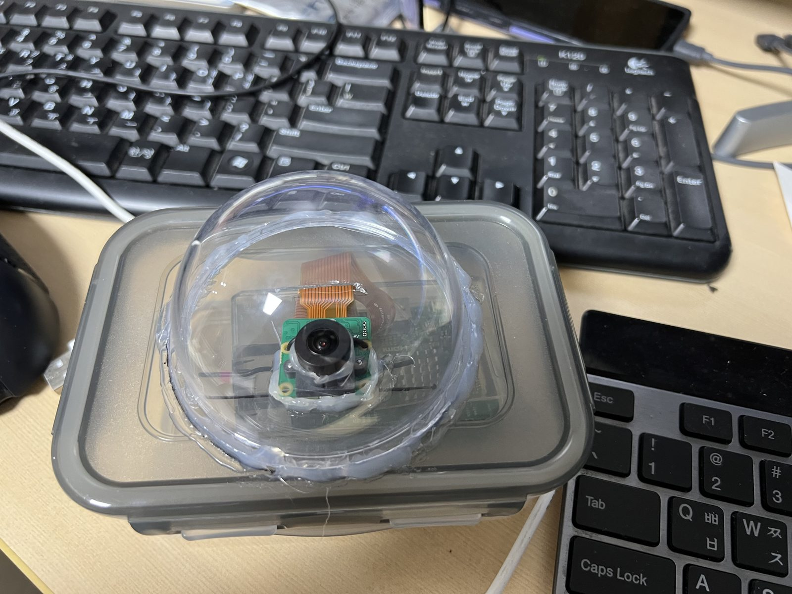

*완성된 카메라 패키지: 음식 보관 용기 뚜껑에 아크릴 돔을 붙이고 그 뒤에 Arducam IMX462를 넣었습니다.*

| | |
| --- | --- |
| **소요 시간** | 약 3시간 (부품 배송 기간 제외) |
| **필요한 기술** | 기본적인 컴퓨터 사용, 터미널에 명령어 복사해 넣기, 드릴과 드라이버 |
| **결과물** | DAM의 내 촬영지(Location)로 사진을 올리고 매일 새 영상을 만드는 카메라 |
| **소프트웨어** | [rpi-camera-agent](https://github.com/chase-nova/rpi-camera-agent) (오픈 소스, Apache-2.0) |
| **이 가이드의 라이선스** | [CC BY 4.0](#라이선스) — 출처를 밝히면 공유·수정 가능 |

> DAM 관리 화면(**Manage**)은 영어로만 제공됩니다. 이 가이드는 버튼과
> 메뉴 이름을 화면에 보이는 그대로(영어) 적고 설명을 덧붙였습니다.

## 목차

1. [DAM 계정 만들기](#1-dam-계정-만들기)
2. [하드웨어 고르기](#2-하드웨어-고르기)
   - [2a. 라즈베리 파이](#2a-라즈베리-파이) · [2b. 카메라 모듈](#2b-카메라-모듈) · [2c. 렌즈](#2c-렌즈) · [2d. 그 밖의 부품](#2d-그-밖의-부품)
3. [야외용 케이스 계획하기](#3-야외용-케이스-계획하기)
4. [작업대에서 조립하기](#4-작업대에서-조립하기)
5. [운영체제 설치하기](#5-운영체제-설치하기)
6. [카메라 소프트웨어 설치하기](#6-카메라-소프트웨어-설치하기)
7. [DAM에 카메라 등록하기](#7-dam에-카메라-등록하기)
8. [초점 맞추기, 시험, 밀봉](#8-초점-맞추기-시험-밀봉)
9. [야외에 설치하기](#9-야외에-설치하기)
10. [일상 관리](#10-일상-관리)
11. [문제 해결](#11-문제-해결)
12. [개인정보, 안전, 라이선스](#12-개인정보-안전-라이선스)

---

## 1. DAM 계정 만들기

이메일 주소로 직접 가입합니다 — 누군가의 승인이 필요하지 않습니다.

1. [chase-nova.com](https://chase-nova.com)에서 **로그인**을 누르고,
   **계정이 없으신가요? 가입하기**를 누릅니다.
2. 이메일 주소를 입력하고 **코드 받기**를 누릅니다 (이미 가입된
   주소라면 화면에 그렇게 표시됩니다 — 로그인하거나, 아래 방법으로
   비밀번호를 재설정하세요). 1분 안에
   `no-reply@chase-nova.com`에서 6자리 코드가 옵니다 (스팸함도
   확인하세요). 코드는 10분 동안 유효하며, **코드 다시 받기**로 새 코드를
   받을 수 있습니다.
3. 코드, 이름, 비밀번호(8자 이상, 영문·숫자·기호만 — 한글이 입력되면
   한/영 키를 확인하세요)를 입력하고, 동의 항목 —
   [이용약관](https://chase-nova.com/ko/terms),
   [개인정보 수집·이용](https://chase-nova.com/ko/privacy), 만 14세 이상 —
   에 체크한 뒤 **계정 만들기**를 누릅니다. 바로 로그인됩니다.

   약관의 핵심: 카메라가 올린 이미지는 공공의 이익(연구, 환경 기록, 교육
   등)을 위해 이용될 수 있으며, 불법·음란·성적 콘텐츠나 서비스 남용은
   영구 이용 정지됩니다. 전문의 사본은 [TERMS.ko.md](TERMS.ko.md)에 있습니다.

새 계정으로 할 수 있는 일:

- **촬영지(Location) 1곳** 만들기 (카메라가 찍는 장소),
- **카메라 1대 등록**하고 보유하기 (내가 그 카메라의 *관리자(custodian)*),
- 카메라를 내 촬영지에 배정하고, 시작/정지하고, 영상을 관리하기.

촬영지의 좌표는 공개되지 않습니다: 나와 DAM 운영자만 볼 수 있습니다.
나중에 카메라나 촬영지를 더 늘리고 싶으면 DAM 운영자에게 한도를 올려
달라고 요청하세요.

비밀번호를 잊었다면 로그인 화면에서 **비밀번호를 잊으셨나요?**를
누르세요 — 이메일로 코드가 오고, 그 코드로 새 비밀번호를 설정합니다.

로그인한 뒤 **관리(Manage)** 를 여세요. **Devices → Register device**가
보이면 준비가 끝난 것입니다.

---

## 2. 하드웨어 고르기

카메라는 서로 독립적인 세 가지 선택으로 이루어집니다: **라즈베리 파이**,
**카메라 모듈**, 그리고 (HQ 카메라라면) **렌즈**. 아래의 어떤 파이든 어떤
카메라와도 함께 쓸 수 있습니다.

### 2a. 라즈베리 파이

아래 두 모델 모두 전력을 적게 씁니다 — 카메라는 몇 초에 한 장씩만
찍으므로 작은 파이로 충분합니다.

| | **Raspberry Pi Zero 2 W** | **Raspberry Pi 3 (B / B+)** |
| --- | --- | --- |
| 전력 소모 | 가장 적음 | 조금 더 많음 |
| 전원 | 5 V, 2.5 A USB (마이크로 USB) | 5 V, **2.5 A** USB (마이크로 USB) — 약한 전원은 저전압을 일으킴 |
| 카메라 커넥터 | 작은 22핀 → **22핀-15핀 카메라 케이블** 필요 | 표준 15핀 — 카메라에 딸린 케이블이 맞음 |
| 네트워크 | 2.4 GHz Wi-Fi | 2.4 GHz Wi-Fi (3B+: 5 GHz도 지원), 이더넷 |
| 크기 | 아주 작음 — 작은 상자에 들어감 | 신용카드 크기 |
| 추천 용도 | 작고 전력이 적은 패키지 | 처음 만들 때 더 쉬움 (설정할 때 이더넷 사용 가능) |

어느 보드든 프로세서에 작은 **방열판**을 붙이세요 (§3).

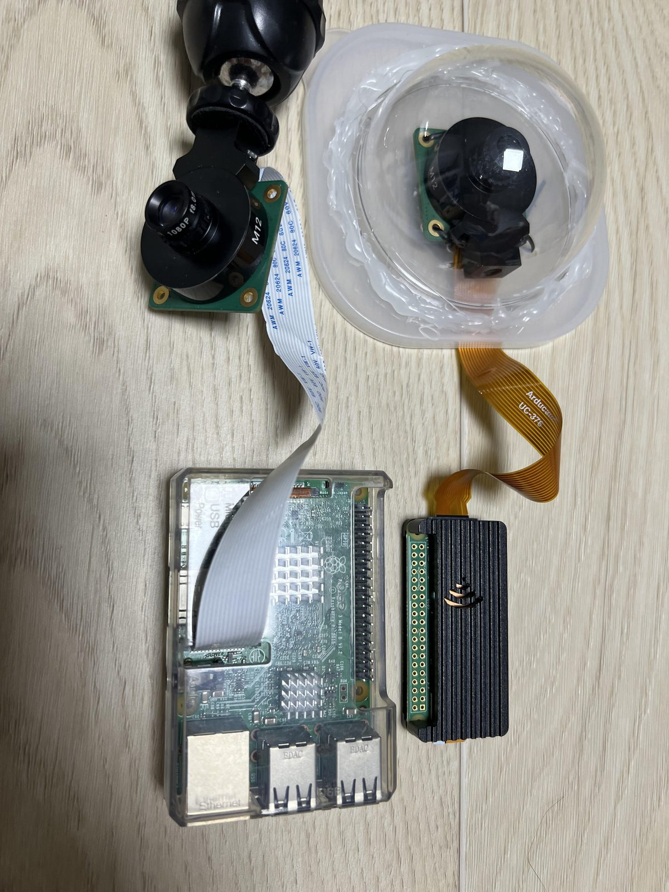

*두 보드를 각각 카메라에 연결한 모습: 투명 케이스의 Pi 3(왼쪽 아래)는 흰색 표준 15핀 케이블로 8 mm 렌즈의 HQ 카메라에, 방열 케이스의 Pi Zero 2 W(오른쪽 아래)는 얇은 주황색 22핀 케이블로 돔 뒤의 카메라에 연결되어 있습니다.*

### 2b. 카메라 모듈

| | **Raspberry Pi HQ Camera (IMX477), M12 마운트** | **Arducam IMX462 저조도 (나이트 비전)** |
| --- | --- | --- |
| 추천 용도 | 낮 풍경, 선명한 사진, 원하는 화각 | 어두운 장소, 밤의 컬러 이미지 |
| 센서 | Sony IMX477, 12.3 MP | Sony IMX462 STARVIS, 2 MP |
| 렌즈 | **교체 가능한 M12 렌즈** — §2c에서 고름 | 아주 밝은 F0.95 렌즈 포함, 약 92° 광각 |
| 설정 | 바로 동작 | 추가 설정 필요 (§5.4): 오버레이, 튜닝 파일, 카메라 펌웨어 1회 업데이트 |
| 밤 | 도시 불빛과 해 질 녘은 잘 나옴; 정말 어두운 장면은 어둡게 남음 | 에이전트의 야간 모드로 실제 밤 이미지 |

§2c의 M12 렌즈를 쓰려면 HQ 카메라 **M12** 버전(CS 마운트 버전 아님)을
사세요. 카메라에는 15핀 리본 케이블이 들어 있습니다. Pi Zero 2 W에는
대신 22핀-15핀 케이블이 필요합니다.

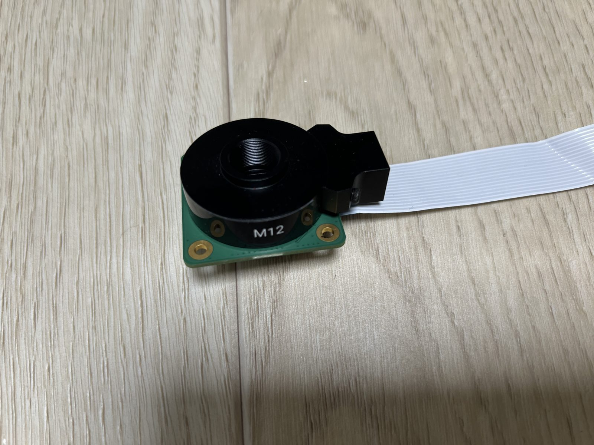

*렌즈를 끼우기 전의 Raspberry Pi HQ Camera M12 버전. (Arducam IMX462는 맨 위 사진의 카메라입니다.)*

### 2c. 렌즈

HQ 카메라 M12용입니다. **얼마나 넓게** 보고 싶은지(수평 화각)로 렌즈를
고르세요:

| 렌즈 | 화각 (수평, 대략) | 용도 |
| --- | --- | --- |
| **1.56 mm 어안** | ~180° (직선이 휘어 보임) | 하늘 전체, 안뜰 |
| **2.8 mm 광각** | ~110–115° | 넓은 풍경, 거리 |
| **4 mm "스타라이트" F1.5** | ~70–80° | **무난한 기본값** — 자연스러운 원근감, 해 질 녘에 유리한 밝은 렌즈 |
| **8 mm** | ~40–45° | 먼 대상: 스카이라인, 산 |

팁:

- 쇼핑몰 상품 설명은 흔히 **대각선** 화각을 적습니다 — 수평 화각은
  20–25 % 더 좁습니다.
- 화각은 센서 크기에 따라서도 달라집니다. 위 숫자는 HQ 카메라 기준입니다.
- **5 MP 이상** 등급의 렌즈를 고르세요. 2 MP 렌즈는 흐릿해 보입니다.
- "**스타라이트**" 렌즈(F1.2–F1.8)는 빛을 더 많이 모아 새벽과 해 질 녘에
  유리합니다. 렌즈의 "IR" 표시는 적외선에서도 초점이 유지된다는 뜻일
  뿐, IR 필터가 있는 HQ 카메라에서 더 좋아지지는 않습니다.
- M12 렌즈는 홀더에 돌려 끼우며, 렌즈를 돌려서 초점을 맞춥니다 (§8).

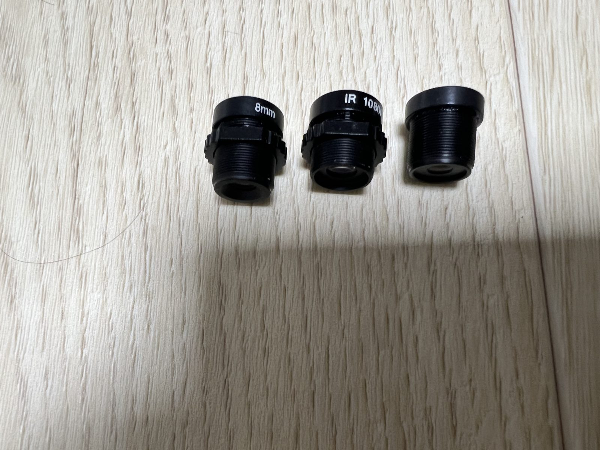

*M12 렌즈: 8 mm, "IR 1080p" 광각 렌즈, 표시가 없는 광각 렌즈. 초점 거리는 보통 경통이나 상자에 적혀 있습니다.*

### 2d. 그 밖의 부품

| 부품 | 참고 |
| --- | --- |
| microSD 카드, 32 GB 이상 | "endurance"(고내구성) 카드가 카메라에서 더 오래 갑니다 |
| USB 전원 어댑터, 5 V 2.5 A | 실내 또는 비바람을 피하는 곳; 상자 **밖**에 둡니다 |
| USB 전원 케이블 (마이크로 USB) | **짧고 굵은 것** — 최대 2–3 m; 길고 가는 케이블은 전압이 떨어짐 |
| 방수 상자 | §3 참고 |
| 아크릴 돔 또는 평평한 아크릴 창 | §3 참고 |
| 케이블 글랜드 (PG7/PG9) + 실외용 실리콘 | 케이블 들어가는 곳을 밀봉 |
| 글루건, 케이블 타이 | 돔, 카메라, 케이블 고정 |
| 파이용 방열판 | 붙이는 타입 |
| 실리카겔 | 내부를 건조하게 유지 |
| 스페이서/나사, 설치 브래킷 | 안쪽에 파이와 카메라를, 바깥에 상자를 고정 |
| 방충망, 차양용 작은 판 | §3 참고 |

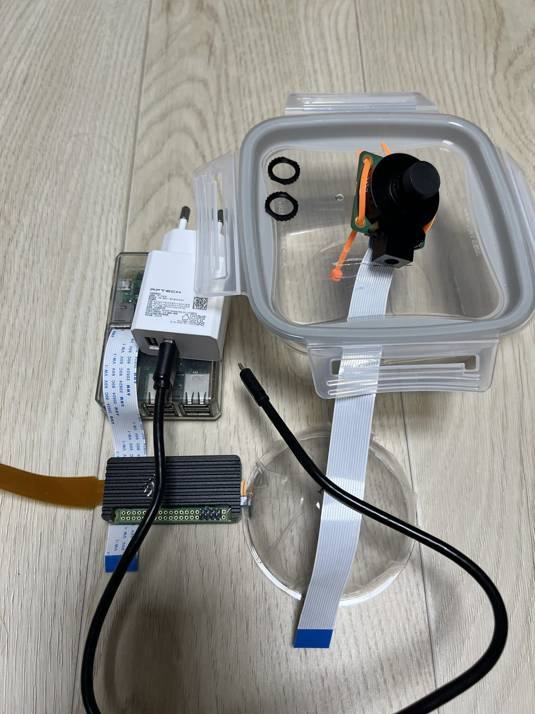

*조립 전의 모든 부품: USB 전원 어댑터와 케이블, Pi 3와 Pi Zero 2 W, 뚜껑에 카메라를 케이블 타이로 고정한 음식 보관 용기, 케이블 글랜드 너트 두 개, 아크릴 돔, 리본 케이블.*

---

## 3. 야외용 케이스 계획하기

케이스가 할 일은 세 가지입니다: 물을 막고, 햇볕의 열을 막고, 카메라가
볼 수 있게 하기. 사람들이 가장 얕보는 것이 열입니다 — 직사광선 아래의
투명한 상자는 **내부가 80 °C**까지 올라가고, 그러면 카메라 소프트웨어가
스스로를 보호하려고 촬영을 멈춥니다.

**상자**
- 뚜껑이 좋은 플라스틱 음식 보관 용기, 또는 IP65 정션 박스.
- 윗면과 햇빛 받는 면을 **흰색으로 하거나 알루미늄 호일 테이프로 덮기** —
  거의 공짜로 할 수 있는 가장 큰 개선입니다.

**카메라 창**
- **아크릴 돔**도 됩니다. 돔은 열을 가두고 김이 서릴 수 있으니 작게
  하세요.
- **평평한 아크릴 창**은 열을 덜 가두고 왜곡이 적습니다 — 특히 어안
  렌즈에 더 좋습니다.
- 창과 상자 사이는 실외용 실리콘으로 밀봉합니다.

**열**
- **이중 지붕**: 상자 위 1–2 cm에 공기층을 두고 작은 판을 올립니다.
  햇볕은 상자가 아니라 판을 데웁니다 — 흔히 10–20 °C 더 시원합니다.
- **통풍구**: 그늘진 쪽 아래와 반대쪽 위에 작은 구멍을 내고 방충망으로
  덮은 뒤, 비가 들어오지 않게 뚜껑 가장자리 아래에 둡니다.
- 파이에 **방열판**을 붙이고, 더운 공기가 보드를 따라 올라가도록 보드를
  세워서 고정합니다.
- **팬은 쓰지 마세요** — 전력을 먹고 저전압을 부릅니다.

**물과 습기**
- 케이블은 **케이블 글랜드**로 위가 아닌 **아래쪽**으로 들입니다.
- 가장 낮은 곳에 작은 **물 빠짐 구멍** 하나.
- 밤에 맺히는 이슬에 대비해 안에 **실리카겔**을 넣습니다.

**전원**
- USB 전원 어댑터는 **상자 밖** 마른 곳에 둡니다 (어댑터도 열을 냅니다).
- USB 케이블은 짧게 유지하세요. 거리가 필요하면 케이블을 늘리지 말고
  어댑터를 가까이 옮기세요.

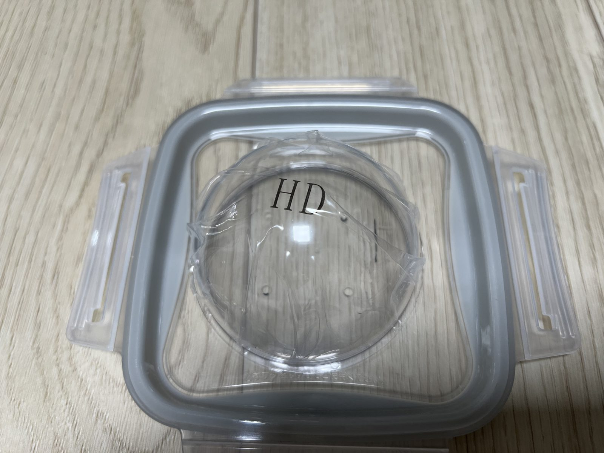

*창 만들기: 뚜껑에 돔 테두리보다 조금 작은 둥근 구멍을 뚫고, 그 위 가운데에 돔을 올립니다.*

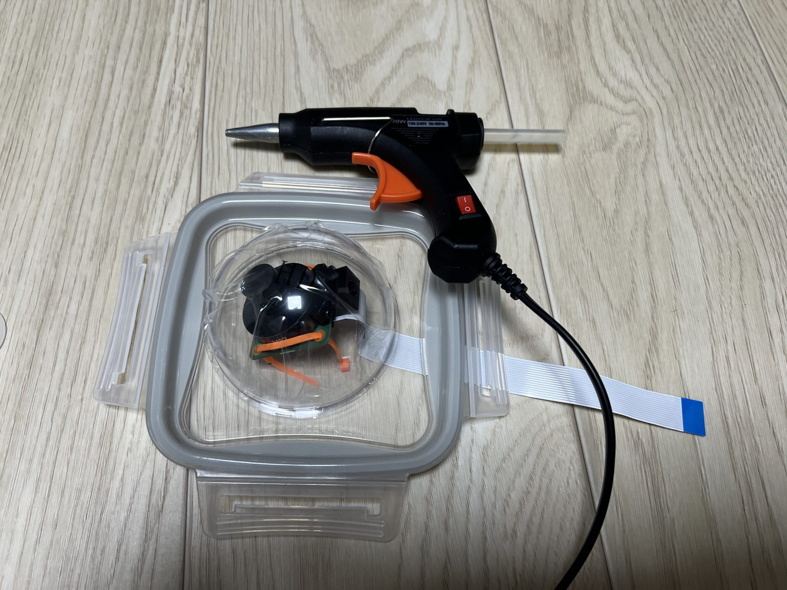

*글루건으로 돔을 뚜껑에 빙 둘러 붙인 뒤, 이음새를 실외용 실리콘으로 마무리합니다.*
*[사진 06 — images/06-sunshade.jpg: 공기층이 있는 이중 지붕]*

---

## 4. 작업대에서 조립하기

모든 것을 **먼저 책상 위에서** 만들고 시험하세요. 상자는 카메라가 동작한
다음에만 밀봉합니다 (§8).

1. 파이의 전원을 끈 상태에서 **카메라 케이블을 연결**합니다. 커넥터
   걸쇠를 들어 올리고, 리본을 끝까지 넣은 뒤(접점 방향은 커넥터에 표시된
   대로), 걸쇠를 눌러 닫습니다. 카메라 보드 쪽도 똑같이 합니다.
   - Pi Zero 2 W: 22핀-15핀 케이블을 씁니다.
2. **렌즈를 끼웁니다** (HQ 카메라 M12): 대략 초점이 맞을 때까지 돌려
   넣습니다. 정밀한 초점은 나중에 맞춥니다.
3. 파이의 프로세서에 **방열판을 붙입니다**.
4. 렌즈가 창에 거의 닿도록(반사가 사라짐), 상자 테두리가 화면에 보이지
   않도록 **카메라를 창 뒤에 고정**합니다 — 카메라 보드 둘레에 작은
   구멍을 뚫고 케이블 타이를 쓰면 좋습니다.
5. **파이를 스페이서에 고정**합니다. 가능하면 세워서.

*[사진 07 — images/07-cable-connected.jpg: 파이와 카메라 커넥터에 연결한 리본 케이블]*
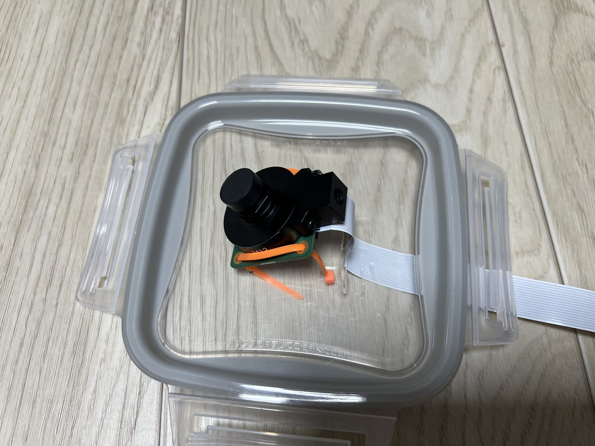

*카메라를 케이블 타이로 뚜껑 안쪽에 고정하고, 렌즈를 창 아래 가운데에 맞췄습니다. 리본 케이블은 뚜껑을 따라 상자로 이어집니다.*

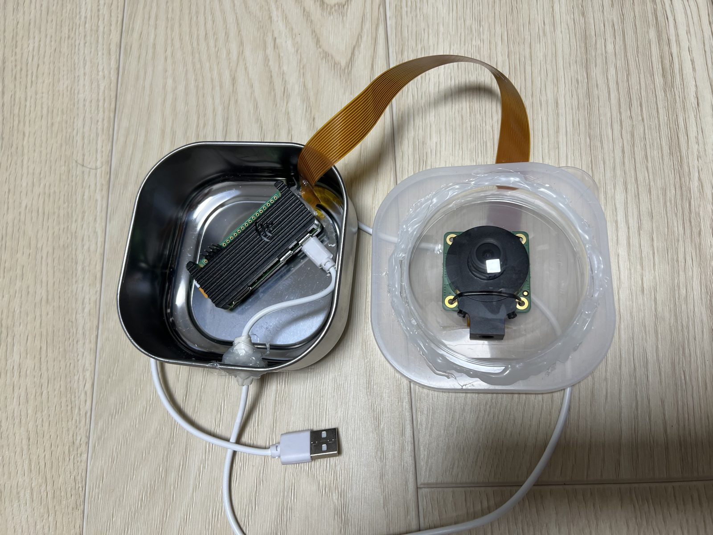

*내부: 상자 안의 방열판 붙인 Pi Zero 2 W, 뚜껑의 카메라로 가는 리본 케이블, 글루로 밀봉한 구멍으로 들어오는 USB 전원 케이블.*

---

## 5. 운영체제 설치하기

### 5.1 SD 카드 굽기

1. 컴퓨터에 **[Raspberry Pi Imager](https://www.raspberrypi.com/software/)**
   를 설치합니다.
2. 파이 모델을 고른 뒤 **Raspberry Pi OS (Legacy, 64-bit) Lite**
   (Bookworm)를 고릅니다. 더 새로운 버전도 HQ 카메라에서는 동작하지만
   첫 부팅 설정 일부가 무시되며, 아래 IMX462 단계는 Bookworm에서
   시험했습니다.
3. **설정**(톱니바퀴 / "Edit settings")을 열고 다음을 설정합니다:
   - 나만의 **호스트 이름**, 예: `dam-kim-1` — 영문자, 숫자, `-`. 카메라를
     여러 대 만든다면 파이마다 다른 호스트 이름을 주세요: 같은 네트워크에
     같은 이름의 파이가 둘 있으면 `ssh <이름>.local`이 어느 쪽에 연결될지
     알 수 없습니다 (DAM의 Devices 페이지가 경고해 줍니다). 호스트 이름은
     내 네트워크 안에서만 쓰이며, DAM은 카메라를 등록할 때(§7.2) 카메라마다
     고유 ID(`dam-…`)를 따로 붙입니다,
   - 사용자 이름과 비밀번호,
   - **Wi-Fi** 이름, 비밀번호, **국가**,
   - **SSH 사용** — 가능하면 공개 키로,
   - 시간대.
4. 카드를 굽습니다.

*[사진 09 — images/09-imager-settings.png: Imager 설정 화면]*

### 5.2 첫 부팅

카드를 파이에 넣고 전원을 켭니다. 1–2분 뒤 컴퓨터에서 접속합니다:

```bash
ssh <user>@dam-kim-1.local        # 또는 ssh <user>@<pi-ip>
sudo apt update && sudo apt full-upgrade -y
sudo reboot
```

나중에 설정을 바꿀 때는 파이의 설정 도구 `sudo raspi-config`를 씁니다
(화살표 키와 Enter): Wi-Fi 국가, I2C 같은 인터페이스(§5.4), 부팅
옵션 등.

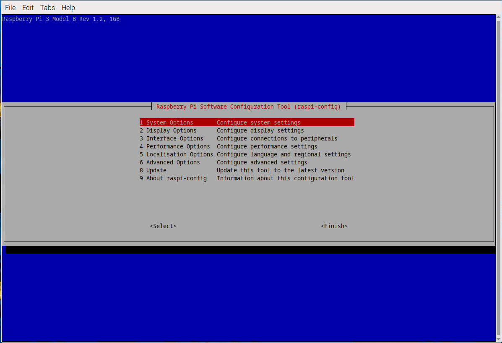

*파이의 설정 도구 `raspi-config`.*

### 5.3 카메라 확인

```bash
rpicam-hello --list-cameras
```

카메라가 보여야 합니다 (HQ 카메라는 `imx477`). 목록이 비어 있으면 전원을
끄고 리본 케이블을 다시 끼우세요 (§11).

### 5.4 Arducam IMX462만 해당

이 카메라는 세 단계가 더 필요합니다 (Bookworm의 Pi 3에서 시험):

1. **카메라 오버레이 켜기.** `/boot/firmware/config.txt`에서
   `camera_auto_detect=0`으로 설정하고 `dtoverlay=arducam-pivariety`를
   추가한 뒤 재부팅합니다.
2. 색과 노출이 맞도록 **튜닝 파일 설치**:
   ```bash
   cd /usr/share/libcamera/ipa/rpi/vc4/
   sudo cp imx462.json arducam-pivariety.json
   ```
3. **카메라 펌웨어를 한 번 업데이트** — 하지 않으면 카메라가 엉뚱한 센서
   모드(예: `2147485568x1080`)를 보고하고 시작을 거부합니다.
   [Arducam IMX462 문서](https://docs.arducam.com/Raspberry-Pi-Camera/Pivariety-Camera/IMX462/)에서
   **내 카메라의 정확한 모델(SKU)** 용 펌웨어 패키지를 쓰세요.
   업데이트 도구는 I2C 버스가 필요합니다:
   ```bash
   sudo raspi-config nonint do_i2c 0
   sudo modprobe i2c-dev
   # 그다음 Arducam의 firmware_update 도구를 안내대로 실행하고 재부팅
   ```
   > **주의:** 펌웨어는 카메라 모델마다 다릅니다 — 잘못된 패키지는
   > 카메라를 벽돌로 만들 수 있습니다.

이후 `rpicam-hello --list-cameras`에 정상적인 1920×1080 모드가 보입니다.
나중에 카메라 라이브러리를 무작정 업그레이드하지 말고, 큰 시스템
업데이트 뒤에는 카메라를 다시 확인하세요.

---

## 6. 카메라 소프트웨어 설치하기

파이에서:

```bash
sudo apt install -y git
git clone https://github.com/chase-nova/rpi-camera-agent.git
cd rpi-camera-agent
./scripts/install.sh
```

설치 프로그램은 카메라 라이브러리, `/opt/dam-agent`의 작은 파이썬 환경,
설정 파일 `/opt/dam-agent/.env.prod`, 그리고 `dam-agent` 백그라운드
서비스를 설치합니다. 카메라는 아직 **시작하지 않습니다** — 등록
토큰(§7)이 필요합니다.

설정 파일을 열어 **시간대**를 설정합니다 (카메라의 현지 시각으로 매일의
영상 이름이 정해집니다):

```bash
nano /opt/dam-agent/.env.prod
```

```ini
TIMEZONE=Asia/Seoul          # IANA 시간대, 예: Europe/Berlin
```

**IMX462만 해당** — 야간 모드도 켭니다 (좋은 출발점이며, 장소에 맞게
조정하세요):

```ini
NIGHT_EXPOSURE_MS=250
NIGHT_GAIN=2
MAX_EXPOSURE_MS=5000
```

나머지 설정은 모두 적당한 기본값이 있습니다. 소프트웨어 저장소의
`.env.example`에 각 설정이 설명되어 있습니다.

---

## 7. DAM에 카메라 등록하기

### 7.1 촬영지 만들기

**Manage → Locations → New location**에서:

- **Name**: 영문자, 숫자, `-` 또는 `_` (예: `River-View`). 이름은 DAM
  전체에서 대소문자 구분 없이 하나뿐이어야 합니다 — 이미 쓰이는 이름이면
  폼이 비어 있는 이름(예: `River-View-2`)을 제안하고, 한 번 클릭으로 고를
  수 있습니다. 영상 파일 이름의 일부가 되며, 카메라가 배정된 동안에는 바꿀
  수 없습니다.
- **Time zone**: 그 장소의 시간대.
- **Coordinates** (선택이지만 권장): 새벽/해 질 녘 일정에 쓰입니다.
  *Use my location*을 누르면 브라우저의 위치로 채워집니다.

### 7.2 카메라 등록하고 토큰 받기

**Manage → Devices → Register device**에서 이름표(label)를 붙입니다 (예:
"옥상 동쪽"). `dame_`로 시작하는 **등록 토큰(enrollment token)** 이
나옵니다:

- **한 번만** 보여 줍니다 — 지금 복사하세요,
- **한 번만** 쓸 수 있고, **48시간 뒤 만료**됩니다.

*[사진 10 — images/10-register-dialog.png: 토큰 대화 상자]*

### 7.3 카메라에 토큰 넣기

파이에서 설정 파일에 토큰을 추가하고 서비스를 시작합니다:

```bash
nano /opt/dam-agent/.env.prod      # ENROLLMENT_TOKEN=dame_...
sudo systemctl start dam-agent
journalctl -u dam-agent -f         # 지켜보기: "enrolled as dam-..."
```

첫 연결에서 카메라는 자기 비밀 키를 만들고, 토큰을 그 키로 교환한 뒤,
파일에서 토큰을 지웁니다. 키는 `/var/lib/dam-agent/credential.json`에
저장됩니다 — 비밀번호처럼 다루세요.

> 토큰을 넘기는 다른 방법: 처음 시작하기 전에 SD 카드의 부트 파티션에
> `dam-agent.env` 파일을 만들고 `ENROLLMENT_TOKEN=dame_...` 한 줄을 넣거나,
> `cd /opt/dam-agent && STAGE=prod .venv/bin/python -m agent.enroll <token>`
> 을 실행합니다.

### 7.4 촬영지에 배정하기

**Manage → Devices**에서 기기를 엽니다 (등록되면 *active*로 표시). 내
촬영지를 고르고 **Assign**을 누릅니다. 촬영 간격 한 번 안에 기기
페이지에 **최신 프레임(latest frame)** 이 나타납니다.

같은 페이지에서 선택 사항:

- **Daily video window** — 하루 중 어느 구간을 영상으로 만들지 정합니다.
  시각(`06:00 → 20:00`)을 입력하거나 프리셋 *Daylight video (dawn →
  dusk)*(새벽 → 해 질 녘), *Night video (dusk → dawn)*(해 질 녘 → 새벽),
  *Full day from dawn (dawn → dawn)*(새벽 → 다음 날 새벽)을 쓰세요.
  `dawn`(새벽)과 `dusk`(해 질 녘)는 다른 시각과 똑같이 쓰이며, 촬영지
  좌표로 매일 다시 계산됩니다 (좌표가 없으면 06:00과 18:00으로 봅니다).
  시작이 끝보다 늦으면 자정을 넘깁니다. **시작과 끝이 같으면 그 시각부터
  다음 날 같은 시각까지 24시간**입니다: `00:00 → 00:00`(기본값)은 자정부터
  자정까지, `dawn → dawn`은 해 뜰 때부터 다음 날 해 뜰 때까지의 영상입니다.
- **Boosted dawn / Boosted dusk** — 해 뜰 때와 해 질 때 사진을 네 배 더
  찍습니다 (영상이 조금 길어집니다).

*[사진 11 — images/11-device-page.png: 첫 프레임이 보이는 기기 페이지]*

---

## 8. 초점 맞추기, 시험, 밀봉

1. **초점**: 파이가 내 네트워크에 있는 동안 브라우저에서
   `http://<pi-ip>:8080/`을 엽니다 (주소는 파이에서 `hostname -I`로
   확인). 먼 곳의 디테일이 가장 선명해질 때까지 M12 렌즈를 천천히 돌린
   뒤 고정합니다 (접착제 한 방울이나 고정 링).
2. **한 시간 시험**: 기기 페이지에 프레임이 계속 들어오고, 온도가
   적당하며, `journalctl -u dam-agent`에 오류가 없어야 합니다.
3. **밀봉**: 실리카겔을 넣고, 뚜껑을 닫고, 케이블 글랜드를 조이고, 창
   가장자리에 실리콘을 바릅니다.

*[사진 12 — images/12-focus-view.png: 초점 맞출 때 쓰는 실시간 화면]*
*[사진 13 — images/13-sealed-unit.jpg: 완전히 포장된 카메라]*

---

## 9. 야외에 설치하기

- **위치**: 렌즈는 경치를 봐야 하지만 상자는 햇볕을 받을 필요가 없습니다 —
  처마 밑이나 그늘진 벽이 가장 좋습니다.
- 단단히 고정하세요: 조금이라도 흔들리면 타임랩스에 보입니다.
- 전원 어댑터는 실내나 비를 피하는 곳에 두고, 케이블은 물이 떨어지도록
  아래로 늘어뜨린 고리(drip loop)를 만들어 상자 아래쪽으로 들입니다.
- 모든 것을 고정하기 전에 최종 위치에서 Wi-Fi 신호를 확인하세요.
- 다음 날, 내 촬영지 페이지에서 첫 영상을 보세요.

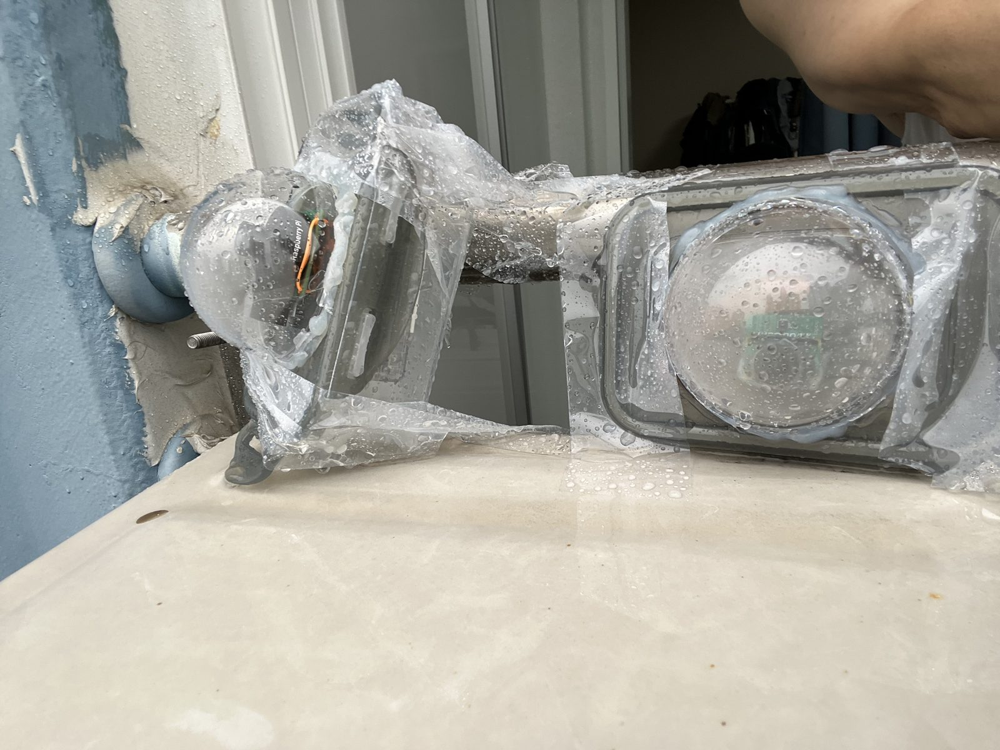

*난간에 설치한 카메라 두 대. 여기서는 투명 비닐 덮개가 이음새에 비가 닿지 않게 막아 줍니다 — 햇볕이 드는 곳이라면 그 위에 차양(§3)을 다세요.*

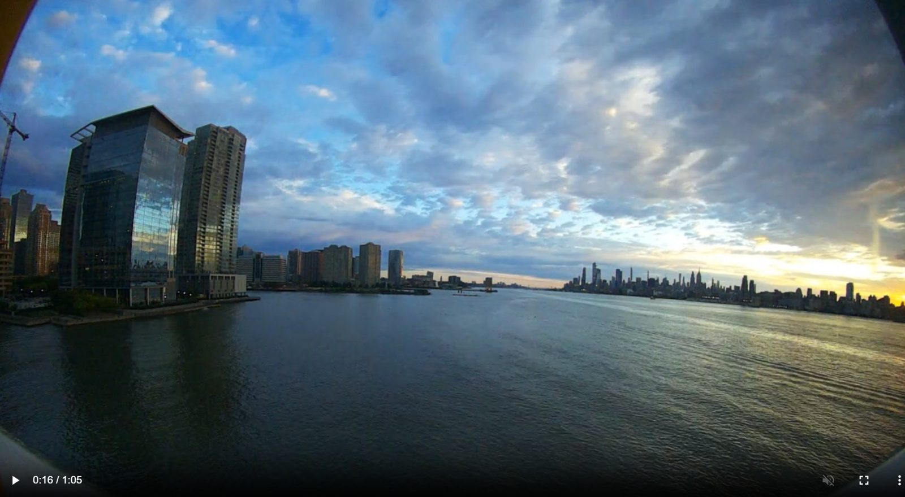

*촬영지 페이지에서 본 카메라의 일일 영상 한 장면 — 하루가 약 1분으로, 여기서는 1:05 중 0:16 지점입니다 (새벽·해 질 녘 부스트로 조금 길어집니다).*

---

## 10. 일상 관리

아래는 모두 **Manage → Devices**의 카메라 페이지에서 합니다.

- **잘 동작하나요?** 페이지에 최신 프레임, 마지막 보고 시각, 온도와
  전원, 올린 사진 수가 보입니다. Devices 목록에서 카메라마다 상태를 한눈에
  볼 수 있습니다.
- **일시 정지와 재개**: *Stop* / *Start* — 촬영 간격 한 번 안에
  적용됩니다. 멈춘 카메라도 온라인 상태는 유지하며, 사진만 찍지 않습니다.
- **원격으로 Wi-Fi 바꾸기**: **Wi-Fi** 패널에서 *Scan networks*를 누르고,
  네트워크를 골라 비밀번호를 입력한 뒤 *Apply & switch*를 누릅니다.
  카메라는 다음 연결 때 전환하며, 연결에 실패하면 이전 네트워크로 스스로
  돌아갑니다.
- **카메라 옮기기**: 내 다른 촬영지를 고르고 *Assign*을 누릅니다. 카메라
  한 대는 한 번에 촬영지 한 곳만 찍습니다.
- **새 SD 카드**: 다시 설치한 뒤 카메라 페이지의 *New SD card token*을
  누르고, 새 토큰을 §7.3처럼 카메라에 넣습니다. 예전 키는 더 이상 쓸 수
  없습니다.
- **잃어버리거나 도난당한 카메라**: **Device token**의 *Disable
  (kill-switch)*을 누르면 모든 업로드가 즉시 멈춥니다. 다시 켜는 것은 DAM
  운영자만 할 수 있습니다 — contact@chase-nova.com으로 연락하세요.
- **내 영상**: **Manage → Locations**에서 내 촬영지를 엽니다. 매일의
  영상은 DAM이 그곳에 추가합니다 (지금은 몇 개씩 모아서 추가하므로, 새 날의
  영상이 보이기까지 하루나 이틀 걸릴 수 있습니다). 영상은 처음에
  **private**(비공개)이며, *private* / *public* 표시를 누르면 공개 사이트에
  보이거나 다시 숨길 수 있습니다.
- **카메라나 촬영지를 더 쓰려면**: 새 계정은 촬영지 1곳과 카메라 1대를
  가질 수 있습니다. DAM 운영자에게 한도를 올려 달라고 요청하세요.

---

## 11. 문제 해결

| 증상 | 가능한 원인과 해결 |
| --- | --- |
| `rpicam-hello --list-cameras`에 아무것도 없음 / 기기 페이지에 **camera not detected** | 리본 케이블이 헐겁거나 뒤집힘 — 전원을 끄고 양쪽을 다시 끼우기; IMX462: §5.4 확인 |
| IMX462가 `2147485568x1080` 같은 모드를 보임 | 카메라 펌웨어 미업데이트 — §5.4 3단계 |
| 맑은 오후에 **camera off (thermal)** | 상자가 너무 뜨거움 — 흰색/호일 상자, 이중 지붕, 통풍구 (§3); 식으면 촬영이 저절로 다시 시작됨 |
| 무작위 재시작, 흐릿한 멈춤, `vcgencmd get_throttled`가 `0x0`이 아님 | 저전압 — 더 강한 5 V 어댑터, 더 짧고 굵은 USB 케이블 |
| **disconnected** | Wi-Fi가 닿지 않거나 전원이 끊김; 카메라는 사진을 SD 카드에 보관했다가 다시 연결되면 올림 |
| 로그에 `enrollment refused` | 토큰이 사용됨, 만료(48시간) 또는 취소됨 — 기기 페이지의 *Re-issue token* |
| 로그에 `not enrolled` | 토큰이 설정되지 않음 — §7.3 |
| 업로드 거부, 기기가 **unassigned** | 촬영지에 배정하기 — §7.4 |
| 창에 김이 서림 | 새 실리카겔, 물 빠짐 구멍 열기, 통풍구가 막히지 않게 |
| "Location name is already in use" | 이름은 DAM 전체에서 대소문자 구분 없이 하나뿐입니다 — 제안된 이름이나 다른 이름을 고르세요 (§7.1) |
| 촬영지를 만들거나 카메라를 등록할 때 "Accept the current Terms of Use…" | 약관이 바뀌었거나 약관 이전에 만든 계정입니다 — **Manage** 위쪽 배너에서 동의하세요 |
| 가입이나 재설정 때 비밀번호가 거부됨 | 영문·숫자·기호만 쓰세요; 키보드 입력 상태(한/영)를 확인하세요 |
| Devices 페이지에 **same hostname as …** | 내 파이 두 대의 호스트 이름이 같습니다 — 파이마다 다른 이름을 주세요 (`sudo hostnamectl set-hostname dam-kim-2` 후 재부팅) |

더 많은 도움: 이 저장소에 이슈를 열어 주세요.

---

## 12. 개인정보, 안전, 라이선스

- 카메라는 **풍경, 스카이라인, 공공장소의 경치**를 향하게 하세요 — 이웃의
  창문이나 마당, 사람을 향하게 하지 마세요. 사는 곳의 카메라 관련 규정을
  확인하세요.
- 계정과 카메라의 키(`credential.json`)는 비공개로 유지하세요.
- 가정용 전원(AC)은 제대로 된 실외용 콘센트나 실내 콘센트에 연결하세요 —
  카메라 상자 안에 두지 마세요.

### 라이선스

이 가이드 — 글과 사진 — 는
**[크리에이티브 커먼즈 저작자표시 4.0 국제 라이선스 (CC BY 4.0)](https://creativecommons.org/licenses/by/4.0/deed.ko)**
를 따릅니다 (전문은 [LICENSE](LICENSE)). 출처를 밝히면 — 예: *"DIY
Raspberry Pi camera for DAM, chase-nova, CC BY 4.0"* 과 이 저장소 링크 —
상업적 이용을 포함해 공유하고 수정할 수 있으며, 수정했다면 그 사실을
밝혀야 합니다.

카메라 소프트웨어 [rpi-camera-agent](https://github.com/chase-nova/rpi-camera-agent)
는 별도로 Apache-2.0 라이선스를 따릅니다. DAM 서비스의 이용약관과
개인정보 처리방침([TERMS.ko.md](TERMS.ko.md), [TERMS.md](TERMS.md))은
서비스와 이용자 사이의 약속이며, 이 CC BY 4.0 가이드에 포함되지 않습니다.

영어 원문([README.md](README.md))과 이 번역이 다를 때는 영어 원문이
기준입니다.
